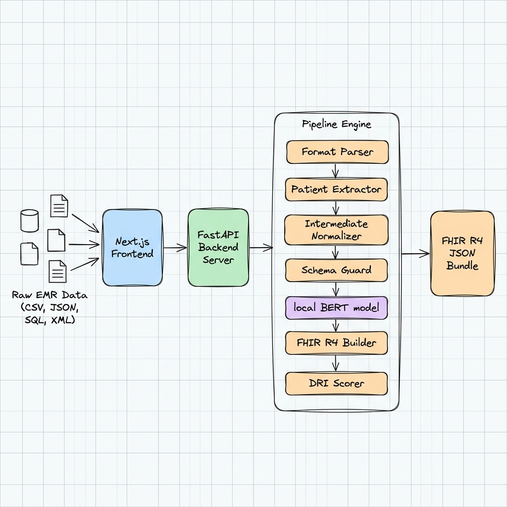
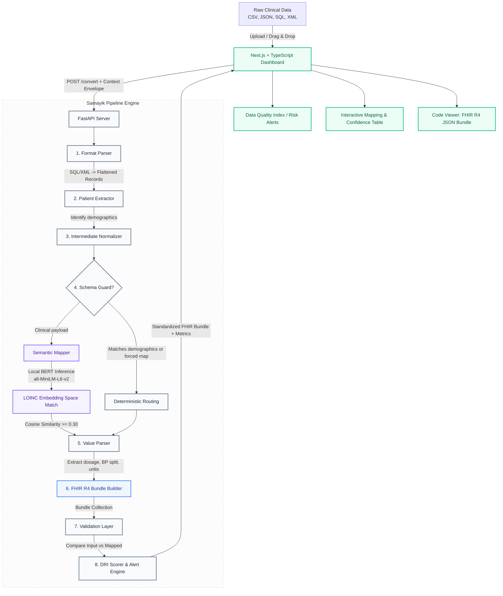

# Samayik — AI-Powered Healthcare Interoperability Platform
### HSIL Hackathon 2026, IIT Patna *(Organized by Harvard T.H. Chan School of Public Health)*

<p align="center">
  
</p>

Samayik is a state-of-the-art, privacy-preserving clinical data standardization platform. It transforms raw, heterogeneous EMR (Electronic Medical Record) datasets—such as patient demographics, vital signs, lab results, medications, and clinical notes—into valid, FHIR R4-compliant JSON bundles.

The system features a **100% offline, locally cached sentence-transformer neural network** to perform semantic mapping of clinical headers to standard LOINC codes, backed by a deterministic Schema Guard, intermediate normalizers, and a clinician-facing Alert & Data Quality engine.

---

## 🏗️ System Architecture & Data Flow



<details>
<summary><b>View Mermaid Diagram Source</b></summary>


</details>

---

## 🌟 Key Features

1. **Multi-Format Format Ingestor:** Supports CSV, JSON, SQL (extracts from `INSERT INTO` statements), and XML clinical records.
2. **Local AI Semantic Mapping:** Runs a cached BERT model (`all-MiniLM-L6-v2` with 22M parameters) to map unstructured clinical fields to their correct LOINC codes offline.
3. **Deterministic Schema Guard:** Prevents PHI/demographics leakage and enforces strict routing rules for predictable fields (e.g., Doctors, Diagnoses, Symptoms).
4. **Intermediate Normalization:** Validates date formats, sanitizes whitespace, and parses complex nested values (like splitting `"140/90"` into component BP observations and normalizing Fahrenheit to Celsius).
5. **Advanced Value Parser:** Extracts drug dosages, normalized units (e.g., `%`, `mg/dL`), and maps drug frequencies (`BD`, `OD`, `SOS`) to standard FHIR timing instructions.
6. **Decision Risk Index (DRI):** Evaluates data completeness based on clinical guidelines, generating granular data quality scores and recommendations for clinicians.
7. **Premium Responsive Dashboard:** Feature-rich dashboard displaying live orchestration, quality index indicators, detailed validation reports, and a code visualizer.

---

## 🛠️ Tech Stack

* **Backend:** Python, FastAPI, Uvicorn, Sentence-Transformers (PyTorch), XMLtoDict
* **Frontend:** Next.js (React 19), TypeScript, Tailwind CSS
* **Standard:** HL7 FHIR R4 Standard (Official Vital Signs Profiles)

---

## 🚀 Getting Started

### Prerequisites
* Python 3.10+
* Node.js 18+ (npm, pnpm, or yarn)

### 1. Run the Backend (FastAPI)
Navigate to the backend folder, create a virtual environment, install requirements, and start the development server:

```bash
cd be
# Create and activate virtual environment
python -m venv venv
.\venv\Scripts\activate  # Windows
source venv/bin/activate  # macOS/Linux

# Install dependencies
pip install -r requirements.txt

# Start FastAPI server
uvicorn api:app --reload --port 8000
```
*Note: On its very first run, Samayik will download `all-MiniLM-L6-v2` locally under `be/model_cache/` so subsequent runs operate 100% offline.*

### 2. Run the Frontend (Next.js)
Navigate to the frontend folder, install dependencies, and spin up the dev server:

```bash
cd fe
# Install Node modules
npm install

# Start Next.js development server
npm run dev
```

Open [http://localhost:3000](http://localhost:3000) in your browser.

### 🧪 Run Local Tests
To test the pipeline engine directly using Python scripts, run:
```bash
cd be
python main.py
```
This runs the pipeline over mock EMR files located in the `tests/` directory (like `tests/01.json`).

---

## 📁 Repository Structure
```
samayik/
├── be/                    # FastAPI Backend
│   ├── api.py            # FastAPI endpoints & CORS configs
│   ├── main.py           # Core SamayikPipeline & NLP algorithms
│   ├── model_cache/      # Cached sentence-transformers model (100% offline)
│   └── requirements.txt  # Python requirements
├── fe/                    # Next.js Frontend
│   ├── app/              # Next.js App Router (page.tsx, layout.tsx)
│   ├── public/           # Static assets
│   └── package.json      # Node configurations & Tailwind settings
├── tests/                 # Clinical testing templates
└── README.md             # Project documentation
```

---
*Created for the **Health Systems & Interoperability Lab (HSIL) Hackathon 2026**.*
